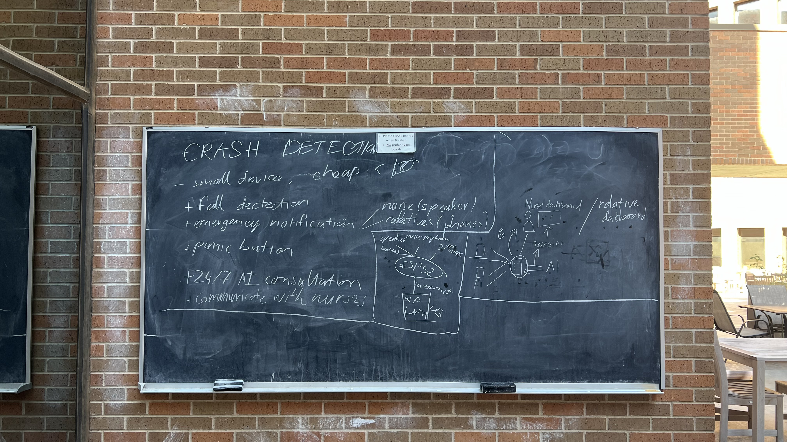

Coming into college, I did not know exactly what to expect. Living on my own was completely new to me and in college I quickly began to realize that making friends was not what I expected.

Back in high school I was part of the IB program, which meant that for better or for worse, I saw the same 40-so students day after day. The community was tight, and everyone knew everyone. My problem was that I was interested in different things then everyone else. I loved tinkering, coding, and hacking, and in my school that sort of thing simply was not in vogue. It did not help that at the time I was extremely loud and annoying too, I had no filter and as such by the time that graduation time came, I wanted to get away from all my peers, not out of resentment, but out of embarrasement.

So when I entered college I quickly found myself facing the polar opposite issue; everybody was interested in the same things that I was, but I did not know anyone at all. I also found that over the course of my high school I did not just start to become more self-consious but also that I was a little more of a recluse.

Thus, I began to do what so many freshmen do their first year, jump at opportunities aimlessly. I joined the racing mavs for a while and worked on the accumulator, I sat into a few AIAA speakers hoping to learn something new, and like that I hopped around from place to place never really finding anywhere I really felt included. Which was when I first heard about hackUTA through a random email in my inbox sent out to the whole engineering department.

While I was vaguely aware of what a hackathon was, as I used to enjoy watching game-dev youtubers build out games in unitiy in 24 hours, but what greeted me was not what I expected at all. The day did not start off on the right track, after showing up to the wrong building, I felt completely stupid. I hate to admit it but at that moment, I thought that things could only go downhill. After realizing my mistake I quickly got back on my bike and made my way to the other side of campus where I finally found the entrance that I thought I was looking for. Since this was my first time ever, I was increadibly nervious and despite showing up to the wrong building I still got there about 5 minutes before check in even began. Dispite that, I sheepeshly approached the table where a few had gathered and quietly waited for the event to begin. From the moment I entered the SWSH building, my expectations where completely blown away. I was handed a qr-tag which was fashoned out of a PCB board almost like something out of DEF CON. I know it is not much but that alone gave me an increadible impression. 

That introduction immediately got me excited, with the high-tech piece of fiberglass and copper around my neck, I wanted nothing more to make something cool. But before I could start I had to find a team.

While I was on the discord before, I had little luck actually joining a team. To most people I was just some nobody. When I asked a group if I wanted to join, they started interviewing me like I was about to work at facebook or something. Looking back on it, I found it laughable how serious people where before the compitition even started. The lack of success I had on here did have a humbling experience on me though. After getting rejected by 3 entirely different groups I decided that I would keep an open mind.

That was when, Triet, a familiar face from my dorm walked into the reception space with full kit in tow, I thanked my lucky starts wasted no time trying to onboard him. With that thing he stood out like a sore thumb, while everyone else had their sleek computers running the latest versions of vs code with addons, there he was with a toolkit and trusty soldering iron. Like me, after sizing up the compitition, he really did not have any plans to compete seriously that year, but as an EE, he could not resist an excuse to play with his tools that he had. After all in a room full of tryhards, I figured that hardware was the one advantage we might have over our compitition, so it was worth a try.

After that we spent the next 30 minutes trying to find people to join us, but as it happens, most people already where grouped up and ready to go, so we had little luck. Just about when we where about to give up though, a team forming event was announced and we made our way into a little room in hopes of filling out our ranks. Out of all the participants that signed up, there where less then a dozen of us in that little room still looking for a team. After brief introductions, to my supprise, two people showed interest in our plan.

The first was a guy named Pasha from UNT. He was the largest of the group and frankly speaking as a mere freshman his presence intimidated me. He clearly was a veteran of many hackathons who carried himself in such a mature and professional way that I could hardly believe he would want to join us. But, he was genuinely interested in helping us newbies out, and found our approach fascinating. Based off his accent I figured that he was ukranian, but it was Triet who finally broke the ice, and when he found out that my mother was ukranian, we quickly began to warm to each other.

The other guy we met was Aaron. He was a transfer student from community college hoping to get his start in computer science. He was very green too yet he was extremely upbeat and excited to get started.

And thus, our ad-hoc team of 3 rookies and 1 professional, we set off to the opening ceremony.

## The Compitition Begins

As soon as the opening ceremony ended, we bolted out of the main room to find a place to scheme. The clock was ticking so I was high on adrenaline. In 24 hours, one way or another, we had to make something from scratch. Pasha on the other hand, laid back with the wisdom of experience to guide him, took the opportunity to get some food before we started. And with that we headed off to a little known plaza on top of Pickard Hall, a concrete jungle that was confortably secluded from the chaos of the other teams and where we would ultimately think up of a plan that would take us to victory.

Me and Triet wanted to do a hardware hack. While we didnt really know what yet, by that point we had a few ideas about what we wanted to do. However it was ever-pragmatic Pasha who helped us decide what to go with. In essence, he told us that we should focus on making a device that can help people. Furthermore, to make it something that we can sell quite easily, he offered that it should have something to do with AI. At the time I could hardly believe my ears as from my understanding, AI was a emerging technology that I had only heard about, and here was someone who spoke of working with it like it was no big deal. Ultimately it was Aaron though who I think came up with the first prototype of our idea, a smart panic button, that could call for a nurse in the case of an incedent. As he had a grandmother who recently suffered an incident at a facility, he thought that it was something that could actually help him out. I realized that it was the perfect excuse to use the really cool lanyards that we had to make it.

After some more brainstorming we settled on building an AI powered smart nurse that would not only act as a panic button but as a companion for the elderly. We then split up the work amongst our interests and abilities: Triet worked on the hardware and implimenting the connectivity and functionality from the microcontroller board, Pasha was the AI guru, he focused on running voice input through an AI model and transmitting back a voice that can respond back. Aaron was tasked with the UI for the console for institutional interface nurses can use to control their fleet. And I was primarly tasked with working on the backend infrastructure.

---
To be continued...
