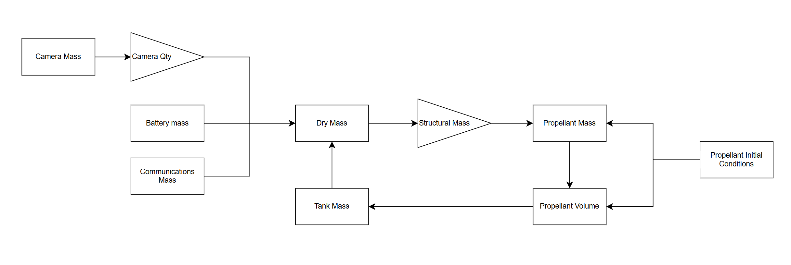
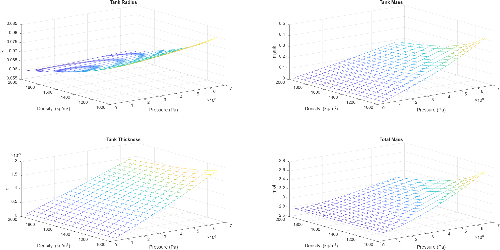
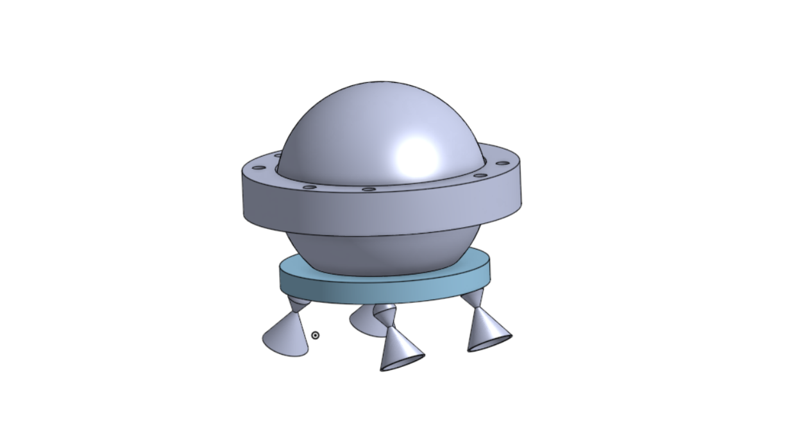

> [!warning] This page is still under construction

As part of this years Nasa TSGC Design Challange we built a lunar follow me camera drone.
Putting together a team
Simulation

### NASA TSGC

[TSGC Presentation](https://www.youtube.com/live/Ous2NCEdfos?si=umjJAxvHM_KCcOf5&t=11756)

### Engineer Banquet (3 mo later)

Active control model