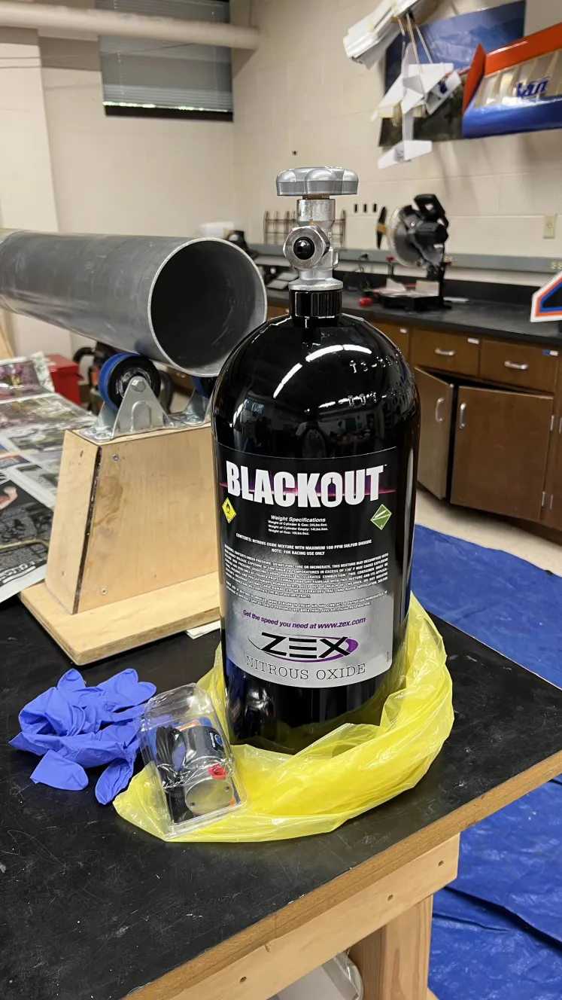
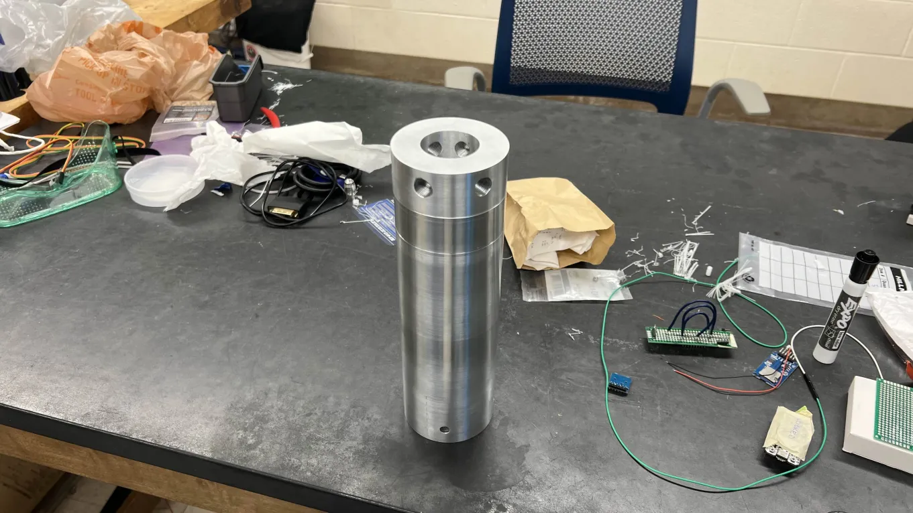
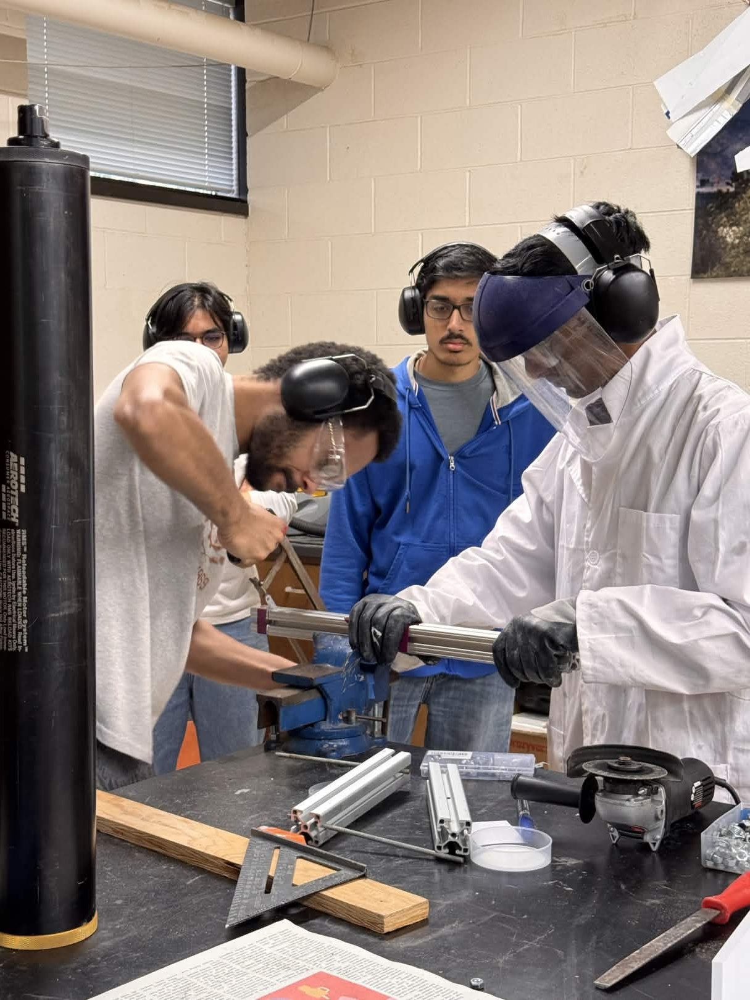
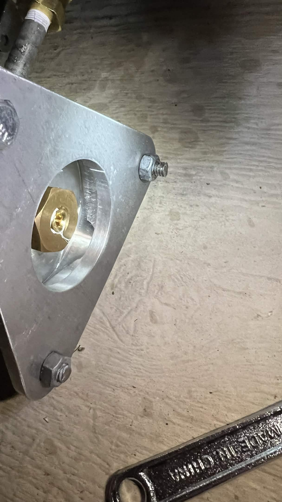
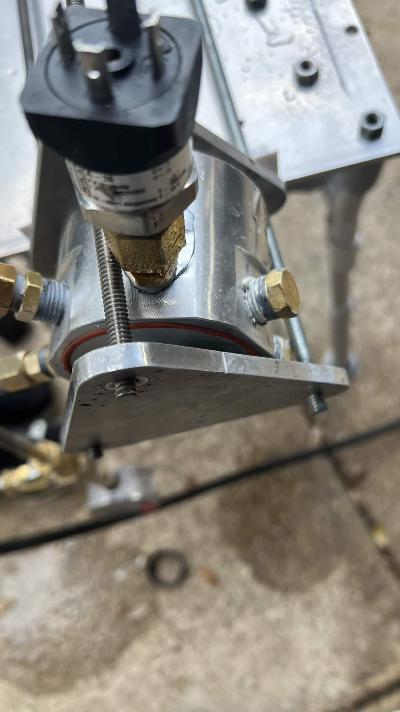
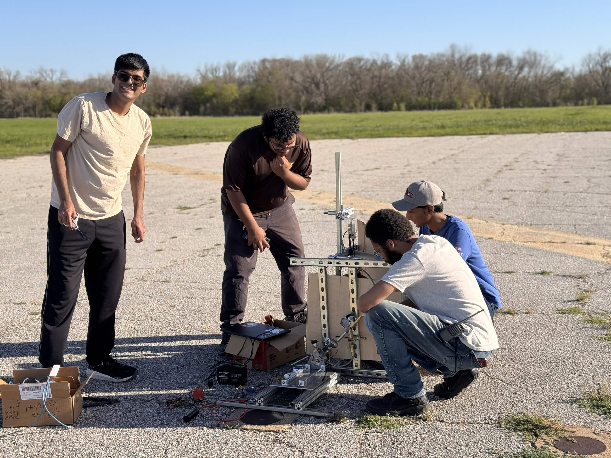

> [!warning] This page is still under construction

The HX1 project is probably the largest project I have worked (and still working) on.  This article is not short, and neither is it comprehensive. My goal however is to cover some of the important lessons learned as well as present the evolution of this project over time. The truth of the matter is that this project has been consuming my time and attention for about 7 months as of writing this.
### Mission: Data

When I joined hybrid division, it had already been inactive for at least 2 years (however I am still not sure because documentation is scant). There where only 4 members left and as the only one with hands on experience with high pressure fluid systems from my research into [Simplex Swirl Injectors](projects/simplex-swirl-injectors/index.md) I was elected Chief Engineer with a singular mission: end the stalemate. What we needed was a demonstrator designed to build technical competency from the ground up and collect data. This series we named HX. To ensure the first iteration, **HX-1**, was more than just a "best guess," I spent the preceding summer developing a comprehensive simulation architecture.

### Mission Requirements

Going into the project must admit that I did not have all too much in terms of a plan. I did not know exactly how everything would come together, nor did I have the experience to really manage a project of this scope; however, I did realize that if I did not want this project to go sideways I had to make preparations and chart a path as soon as possible.  I started reading as much as I could on technical project management. I found that most of the most relevant information on this matter where [What Made Apollo a success?](https://ntrs.nasa.gov/api/citations/19720005243/downloads/19720005243.pdf), [Half Cat Rocketry Vehicle Design Guide](https://drive.google.com/file/d/1EzwgKEPsJ50NjWJJ_NhrYJfyHFjFNQsr/view),[Rules for the Design Development and operation of Flight Systems](https://standards.nasa.gov/sites/default/files/standards/GSFC/H/0/GSFC-STD-1000RevH_Approved.pdf) , [NASA Reliability Preferred Practices for Design and Test](https://ntrs.nasa.gov/api/citations/19920003068/downloads/19920003068.pdf), and [100 Rules for NASA Project Managers](https://www.projectsmart.co.uk/recommended-reads/one-hundred-rules-for-nasa-project-managers.pdf). Around that time I also had the opportunity to attend a talk hosted by our local AIAA chapter which discussed the project planning from industry. This talk was incredibly transformative to the way that I viewed the design and motivated me to crystalize the core requirements of the system. Some of the most notable of these requirements where:

 - The design had to provide the data needed to scale to a larger engine (Internal ballistics, Injector characterization, Engine Dynamics, etc)
 - The design would heavily lean on COTS components
 - The engine would have a maximum impulse of 2000 Ns but also have a oxidizer mass flux of less than 600 kg/m^2
 - The engine had to be compliant with TUSC and NFPA
	 - The temperature gradient had to be below 200 K
	 - The chamber had to be made of nonferrous materials
 - The system had to be passively safe (return to safe state on its own)
### The Design Stage

The bedrock of HX-1 were various models written in MATLAB, Simulink, and Python. The Idea was that as the design progressed, the various models we had would improve. Little did I realize how much the models would develop even before we had any sort of empirical data or how much the system would progress.

At first the design was very scattered. We used a lot of the solvers I developed initially for the conceptual design of the [Longshot](projects/longshot/index.md) engine, but this assortment of tools had their limitations. I have learned a lot since I started this project and as all things go, to the point where If I was to start again today, my approach would be fundamentally different in several ways.

The first part of the design that I investigated was the Chemical Kinetics. At the time I was not all too familiar with hybrid rocket engines as most of my knowledge either came from Roceket Propulsion Elements, or Liquid Rocket Thrust Chambers and I was still reading through The Science And Design of the Hybrid Rocket Engine. I figured that in a chemical rocket engine, no matter the type or build, the performance ultimately originated from the chemical processes, so modeling the potential reactions was the natural starting point. I was at this time well familiar with chemical equilibrium modelling typically used for liquid rocket engines from reading [Introduction to Combustion](https://fenix.ciencias.ulisboa.pt/downloadFile/1126037345803917/An%20Introduction%20To%20Combustion.hm(booksformech.blogspot.com).pdf) as well as tools for this sort of analysis like NASA CEA and ProPEP. I was also oddly obsessed with having it set up as a multi-physics simulation in Simulink, and for a while also fiddled with Candela to try to get something set up with openFOAM. Ultimately I stopped short of that, and instead made my own CEA wrapper for MATLAB, which combined with my reading from Newlands, convinced me to go with Paraffin wax which was in itself a decent enough launchpad for continued exploration.

For the oxidizer, there really was only one clear choice, Nitrous oxide. Not only was is self-pressurizing and less scary then oxygen, it was the only propellant allowed, so other then research how to safely manage the stuff, I did not do all too much reasearch into alternatives (Although I did find promising research on a Nitrous-LOX blend which promised some really nice characteristics)

Once a propellant was chosen I began to work on the internal ballistics modelling. For those not in the know, what makes hybrid systems particularly special are their unique blend of internal ballistics. For various reasons I will avoid going into too much depth, this is where I was affirmed of my prior belief that we had to model the system numerically. At the time my model was primarily made up of various research papers that I had read. 

At the same time I was working on the dynamics  design could handle the transition from liquid to gaseous N2​O during blowdown.

Cooling system

It was around this time I was finishing up on the management research that I mentioned earlier, and as such we used the next month to organize the work that we had done into a CDR presentation.
 

### CDR revisions
### Raising Funds
Club growth
Research proposals

### Breaking Ground

### First Hydrostatic Test
The missing parts

Broken Pump
Broken Regulator
Broken Manifold

### Second Hydrostatic Test & Cold Flow attempt

