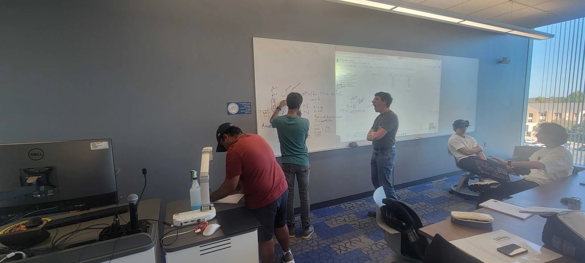

This project aims to implement throttling into our hybrid rocket engine design in order to reduce the aerodynamic loading and efficiency of the vehicle. 

> [!warning] This page is still under construction
## Proposal

Got accepted with Dr. Chen and Dr. Chakravarthy as PIs 

11.21 - working on seting up EoM and pintle transfer function
