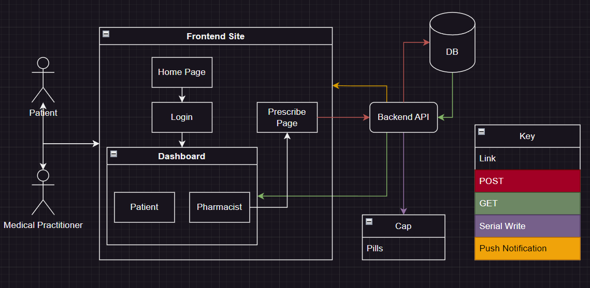
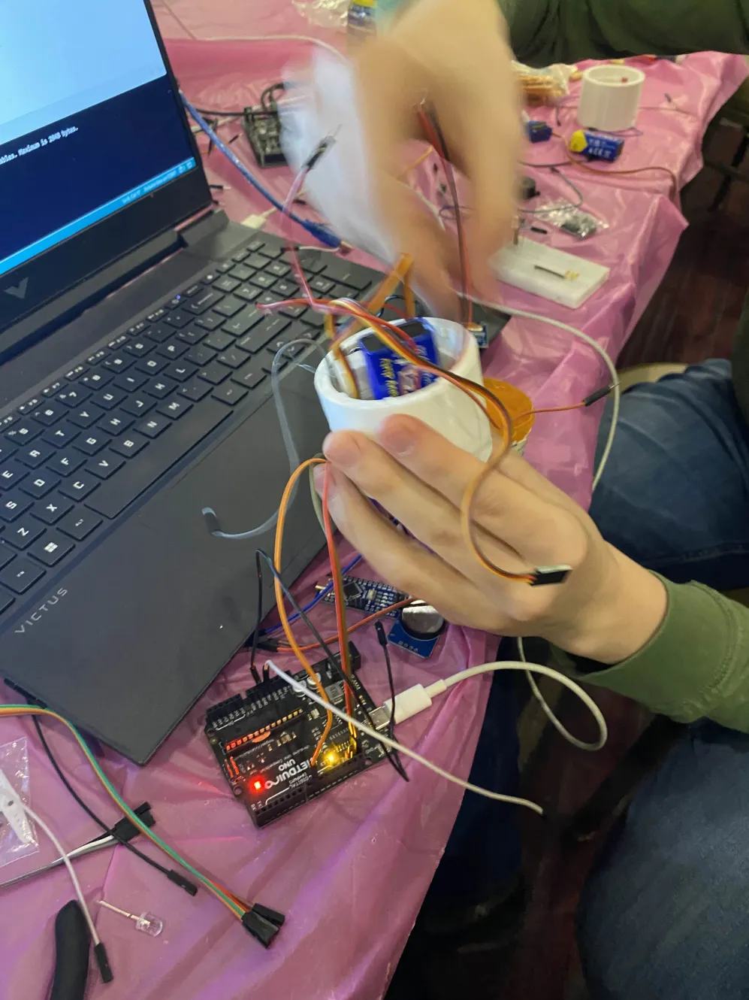
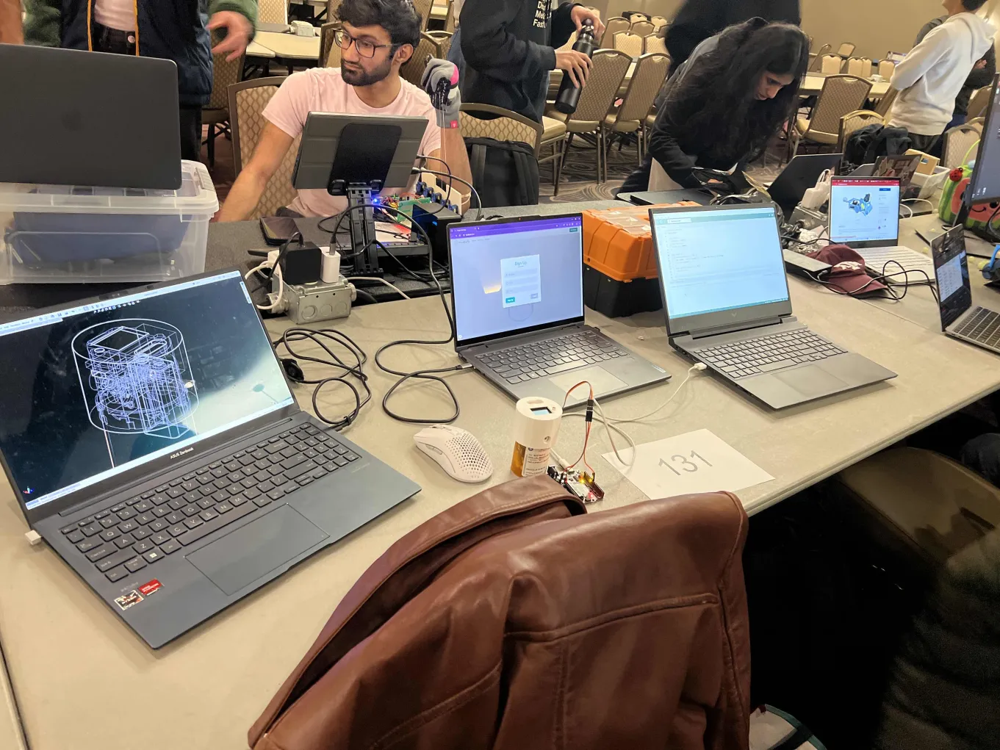

This project we created a smart pill cap prototype in order to prescription reduce drug abuse as well as help remind and measure dosages.

> [!warning] This page is still under construction

Backend archetecture

Rapid Prototyping

The battery took up the majorit of the space so the wiring was messy

Our microcontroller got fried right before judging, so we switched to external microcontroller for code. Here was what our system looked like

We won in our competition  :::DDD

40 Hours with no sleep
